# FOC Companion - FOC-Stim Mobile Application

## Overview

FOC Companion is the mobile counterpart to the [restim-desktop](https://github.com/diglet48/restim-desktop) application. It allows users to control and synchronize their **FOC-Stim** device directly from an Android or iOS device.

FOC-Stim is an open-hardware device designed for high-performance electromagnetic stimulation. This application connects to the device over TCP (WiFi) or Serial (USB) to manage pulse parameters, patterns, and media synchronization.

## Features

- **Real-time Device Control:** Connect to your FOC-Stim device and manage stimulation parameters on the fly.
- **Pattern Support:** Port of 17+ patterns from the desktop application with a "Driver Cockpit" UI for real-time control.
- **Multi-Phase Support:** Full support for both 3-phase and 4-phase output modes.
- **Device Status Monitoring:** Real-time feedback on temperature, battery, and pulse frequency.
- **Media Synchronization (Parked):** Synchronize with popular video players like **HereSphere** using TCP sockets. This feature is currently hidden to focus on stand-alone device control.
- **Automatic Funscript Loading (Parked):** Load `.funscript` files from local storage or network shares (WebDAV).

## Screenshots

| 01 - Not connected (3Phase) | 02 - Not connected (4Phase) | 03 - Pulse Settings | 04 - Device Settings |
|:---:|:---:|:---:|:---:|
| 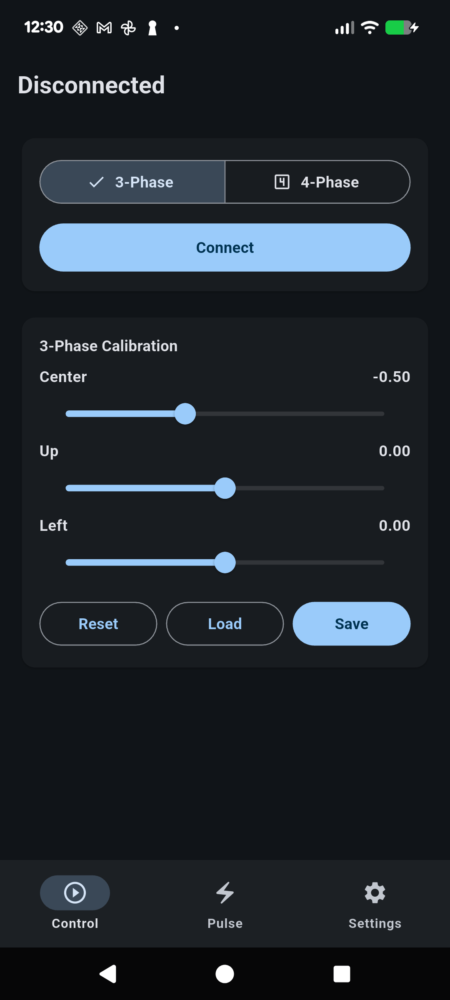 | 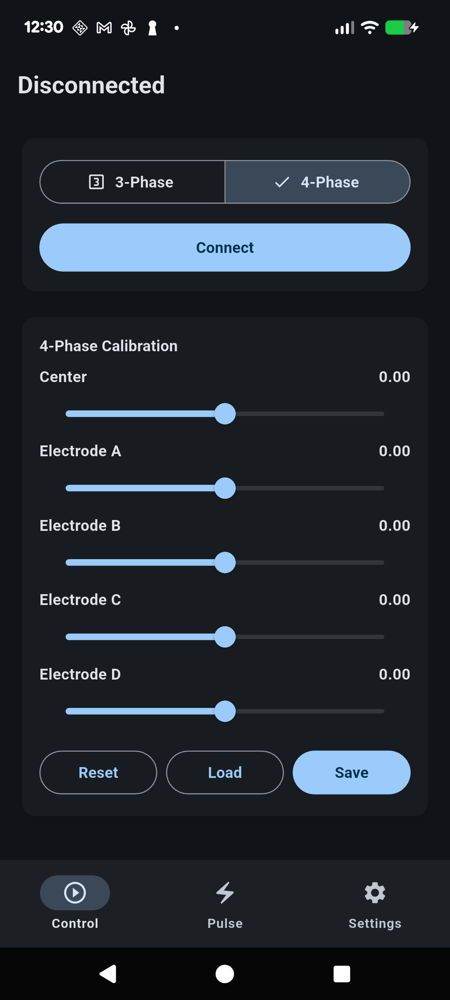 | 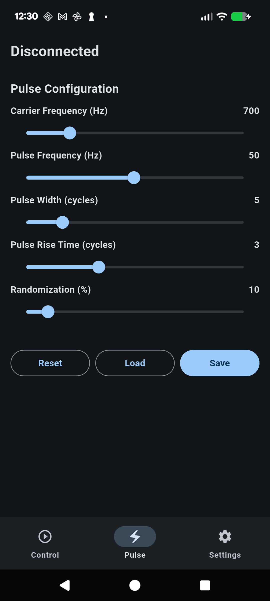 | 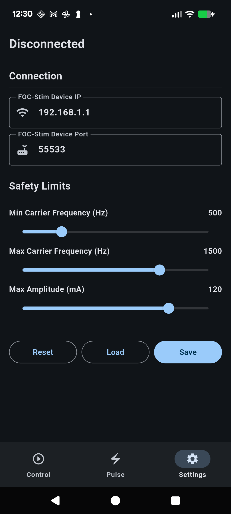 |

| 05 - Connected | 06 - Calibration | 07 - Playing Pattern | 08 - Pulse Modulation (Freq) |
|:---:|:---:|:---:|:---:|
| 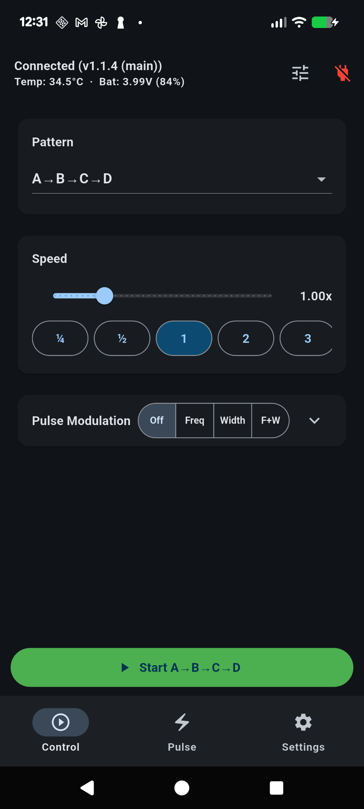 | 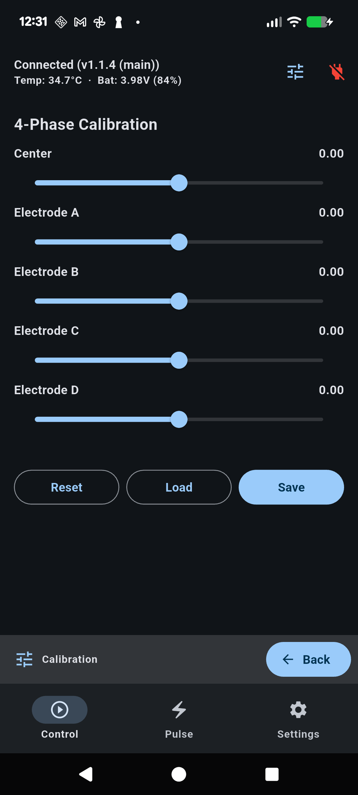 | 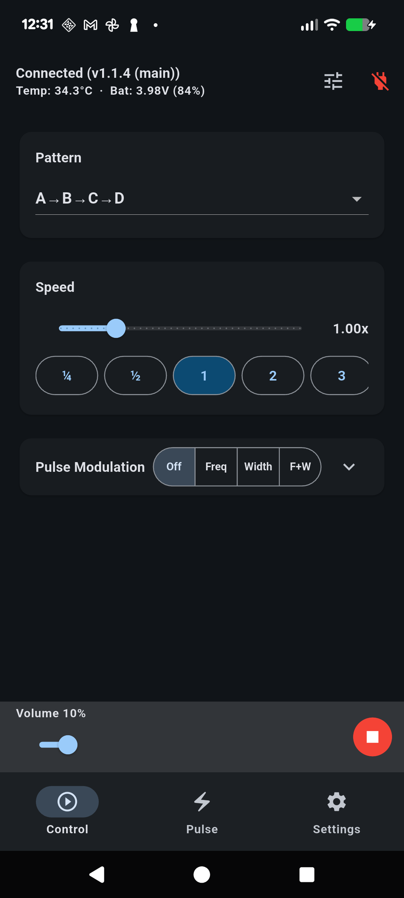 | 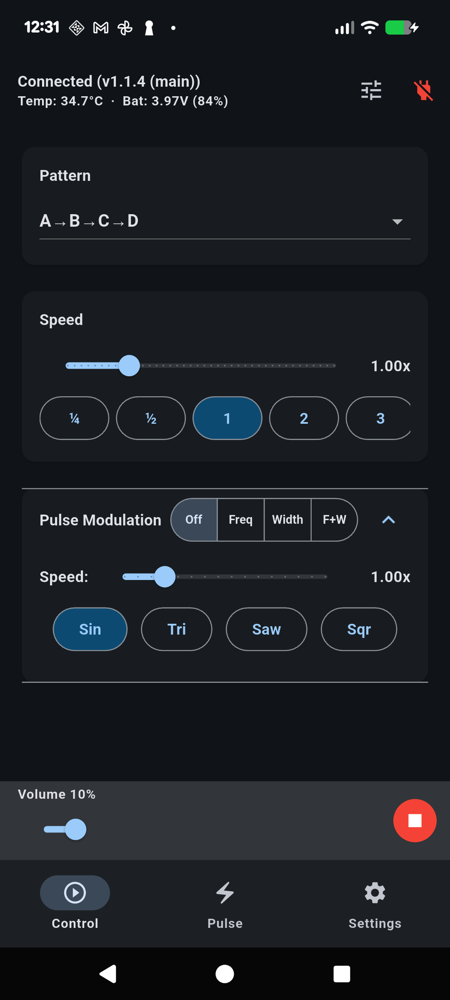 |

| 09 - Pulse Modulation (Width) | 10 - Pulse Modulation (Both) | 11 - Pulse Modulation |
|:---:|:---:|:---:|
| 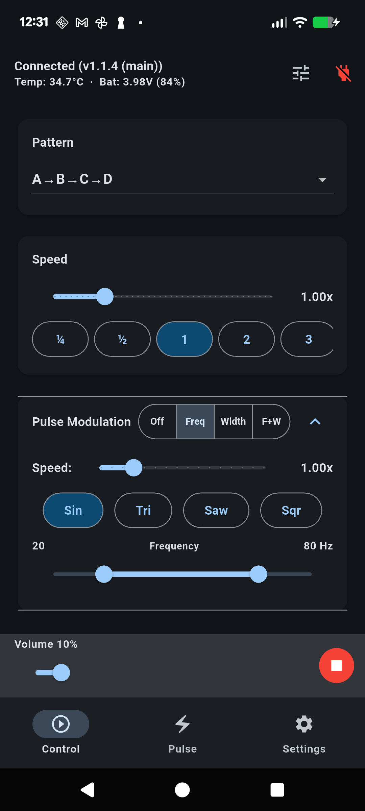 | 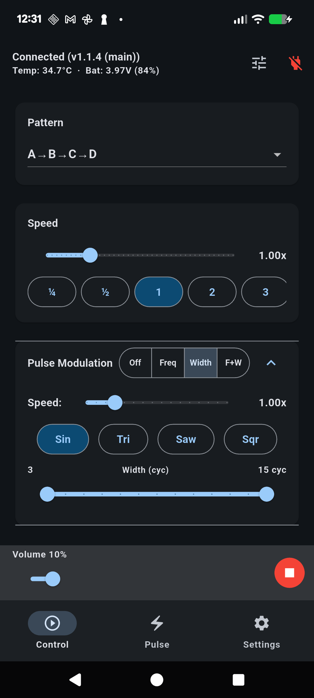 | 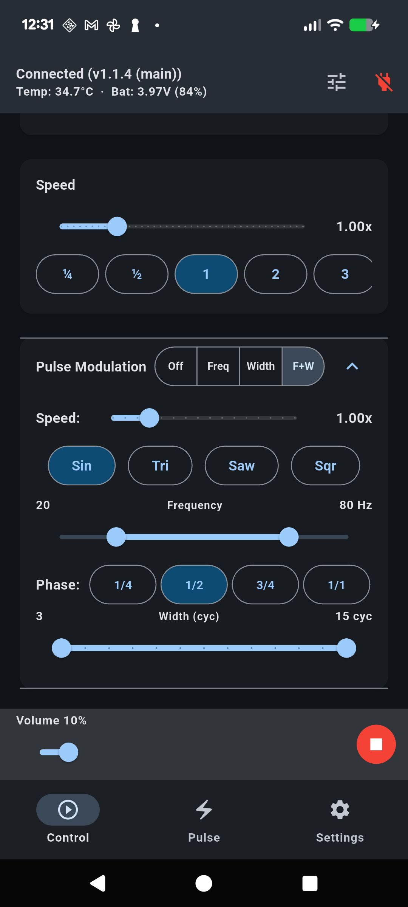 |

## Project Structure

- `foc-companion/`: The primary mobile application built with Flutter.
- `documents/`: Comprehensive functional specifications and protocol documentation.
- `todo/`: Detailed task lists and research for ongoing development.

## Getting Started

To get started with the application, please see the [QUICK_START.md](QUICK_START.md) guide.

For detailed network setup and troubleshooting, refer to [NETWORK_TROUBLESHOOTING.md](documents/features-parked/NETWORK_TROUBLESHOOTING.md).

For information on the currently parked media synchronization features, see [MEDIA_SYNC_USAGE.md](documents/features-parked/MEDIA_SYNC_USAGE.md).

## Security

We take security seriously. Please refer to [SECURITY.md](SECURITY.md) for information on reporting vulnerabilities.

## License

This project is licensed under the MIT License - see the [LICENSE](LICENSE) file for details.

## Acknowledgments

- [restim-desktop](https://github.com/diglet48/restim-desktop) for the original implementation and patterns.
- [FOC-Stim](https://github.com/diglet48/FOC-Stim) for the open-hardware device and protocol.
- All contributors and beta testers in the community.
